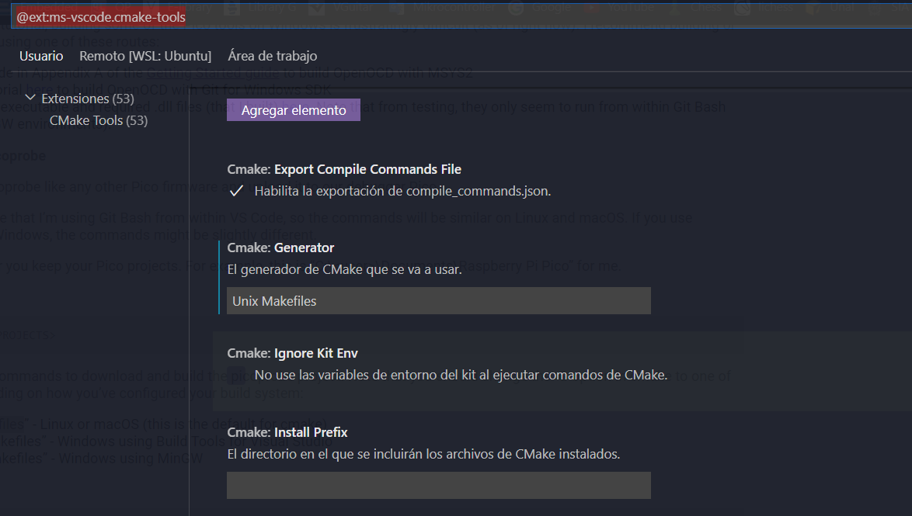

# Instalación de SDK RaspberryPi pico

Instalar dependencias

```sh
sudo apt update
sudo apt upgrade
sudo apt install git cmake gcc-arm-none-eabi gcc g++ libstdc++-arm-none-eabi-newlib libnewlib-arm-none-eabi
sudo apt install automake autoconf build-essential texinfo libtool libftdi-dev libusb-1.0-0-dev
sudo apt install doxygen
sudo apt install pkg-config
```

Crear una carpeta para almacenar todas las dependencias, en este caso se utiliza la carpeta `pico` en el directorio home

```sh
mkdir ~/pico
```

Descargar repositorios

```sh
cd ~/pico
git clone -b master https://github.com/raspberrypi/pico-sdk.git
git clone -b master https://github.com/raspberrypi/pico-examples.git
git clone -b master https://github.com/raspberrypi/pico-extras.git
git clone -b master https://github.com/raspberrypi/pico-playground.git
cd ~/pico/pico-sdk
sudo git submodule update --init
```

Añadir el toolchain al PATH

```sh
# Añadir las siguientes linea a ~/.bashrc
export PICO_SDK_PATH=/home/camilo/pico/pico-sdk
export PICO_EXAMPLES_PATH=/home/camilo/pico/pico-examples
export PICO_EXTRAS_PATH=/home/camilo/pico/pico-extras
export PICO_PLAYGROUND_PATH=/home/camilo/pico/pico-playground
# Recargar el PATH
source ~/.bashrc
```

Compilar los ejemplos

```sh
sudo mkdir ~/pico/pico-examples/build
sudo chmod 777 ~/pico/pico-examples/build
cd ~/pico/pico-examples/build
cmake ..
```

Ingresar a ejemplo especifico y compilarlo con make, si hay un .uf2 es que todo salio bien.

```sh
cd blink
make
```

# Picoprobe para debug

## Configuración de USB en WSL (USBIP)

Solo aplicar esta configuración en caso de usar WSL, de lo contrario pasar al siguiente paso.

### Configuración en Linux

```sh
sudo apt install linux-tools-virtual hwdata
sudo update-alternatives --install /usr/local/bin/usbip usbip /usr/lib/linux-tools/*/usbip 20
```

### Configuración en Windows

En powershell como administrador

```powershell
winget install --interactive --exact dorssel.usbipd-win
```

Listar dispositivos usb y ver ID con lo siguiente

```powershell
usbipd wsl list
```

Conectar el dispositivo USB a Linux y desconectarlo de Windows

```powershell
usbipd wsl attach -b 1-12 -d Ubuntu-USBIP
# Remplazar "1-12" por el ID del USB
# Remplazar "Ubuntu-USBIP" por la distribución utilizada, o dejar en blanco en caso de que se quiera usar la distribución por defecto
```

## Configuración de herramientas

### Picotool

Descargar repositorio y compilar picotool

```sh
cd ~/pico
git clone -b master https://github.com/raspberrypi/picotool.git

mkdir ~/pico/picotool/build
cd ~/pico/picotool/build
cmake ../
make
```

Copiar el compilado a `/usr/local/bin/` con el fin de ejecutarlo desde cualquier directorio

```sh
sudo cp picotool /usr/local/bin/
```

### Picoprobe

Clonar repositorio y compilar picoprobe

```sh
cd ~/pico
git clone -b master https://github.com/raspberrypi/picoprobe.git
mkdir ~/pico/picoprobe/build
cd ~/pico/picoprobe/build
cmake ../
make
```

Descargar el archivo .uf2 en la raspberry pi pico

### OpenOCD

```sh
sudo apt install gdb-multiarch
```

Clonar repositorio y compilar

```sh
cd ~/pico
git clone https://github.com/raspberrypi/openocd.git --branch rp2040 --depth=1
cd openocd
./bootstrap
./configure --enable-picoprobe --enable-ftdi --enable-sysfsgpio --enable-bcm2835gpio
make
sudo make install​
```

### Solucionar permisos de acceso a picoprobe

```sh
sudo nano /etc/udev/rules.d/60-openocd.rules
ATTRS{idVendor}=="2e8a", ATTRS{idProduct}=="0004", MODE="660", GROUP="plugdev", TAG+="uaccess"
sudo usermod -a -G plugdev camilo
sudo service udev restart
sudo udevadm control --reload
```

Conectar y desconectar el dispositivo, luego probar con el siguiente comando

```sh
openocd -f interface/picoprobe.cfg -f target/rp2040.cfg -s tcl
```

### Configuración en vscode

instalar dependencias

```sh
sudo apt install libx11-xcb1 libxcb-dri3-0 libdrm2 libgbm1 libegl-mesa0
code --install-extension marus25.cortex-debug
code --install-extension ms-vscode.cmake-tools
code --install-extension ms-vscode.cpptools
```

Configurar extension de Cmake Tools para usar `Unix Makefiles`



### Ejecutar sesión de Debug

* Abrir WSL y reiniciar el servicio `udev` mediante el siguiente comando

```sh
sudo service udev restart
```

* Conectar picoprobe a un puerto USB
* Conectar picoprobe a WSL mediante USBIP con lo siguientes comandos en Powershell en modo de administrador

```powershell
usbipd wsl list # Obtener ID del dispositivo
usbipd wsl attach -b 1-12 -d Ubuntu-USBIP # Remplazar 1-12 por el ID del dispositivo
```

* Probar la conexión con el siguiente comando

```sh
openocd -f interface/picoprobe.cfg -f target/rp2040.cfg -s tcl
```
